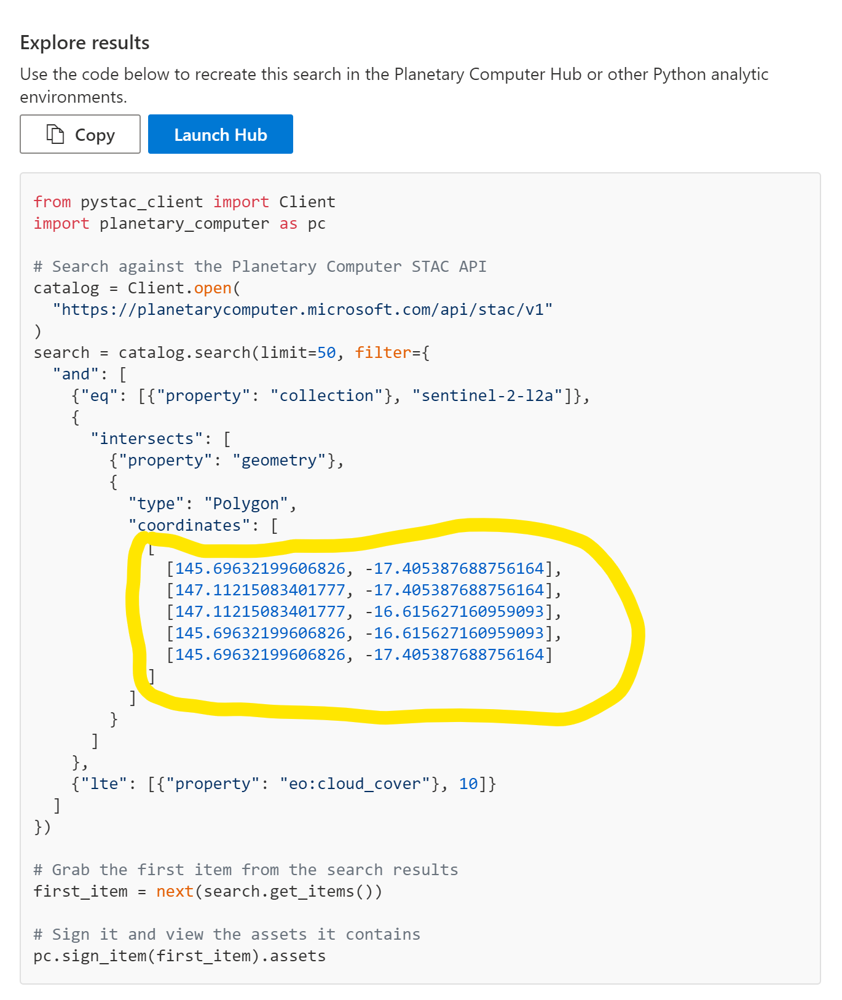

<table>
<colgroup>
<col style="width: 100%" />
</colgroup>
<tbody>
<tr class="odd">
<td></td>
</tr>
<tr class="even">
<td></td>
</tr>
<tr class="odd">
<td>
December 3<strong>, 2021</strong>

MTC Sydney

Authored by: Viren Joseph, Leon Smith
</td>
</tr>
</tbody>
</table>

# Contents

[2 Introduction [3](#introduction)](#introduction)

[3 Pre-requisites [4](#pre-requisites)](#pre-requisites)

[4 Demonstrate the Data Catalog
[5](#demonstrate-the-data-catalog)](#demonstrate-the-data-catalog)

[5 Demonstrate the Explorer
[6](#demonstrate-the-explorer)](#demonstrate-the-explorer)

[6 Demonstrate the Hub [8](#demonstrate-the-hub)](#demonstrate-the-hub)

[7 Make Changes and Run the notebook
[8](#make-changes-and-run-the-notebook)](#make-changes-and-run-the-notebook)

[8 Theoretical - Detecting Coral Bleaching Events
[13](#theoretical---detecting-coral-bleaching-events)](#theoretical---detecting-coral-bleaching-events)

# Introduction

This document is meant to help you demonstrate the Planetary Computer in
a locally relevant way

In this example, we will use the planetary computer to build the latest
satellite imagery over the Great Barrier Reef in Australia.

There is significant attention on the sustainability of the Great
Barrier Reef, which has in the recent years seen advanced levels of
bleaching episodes occur through oceans warming to a greater extent due
to climatic change.

Given that the Great Barrier Reef extends over 344 hundred thousand
square kilometres, and 14 degrees of latitude , it is extremely
difficult to effectively monitor solely from the ground. However a
combination of satellite imagery and ground truths can help begin to
solve these problems. But Satellite Imagery analysis has its own high
barrier of entry. Until now. With the planetary computer, an initiative
under Microsoft's sustainability umbrella.

In order to get a good view of the entire reef, we need to first find
the individual images from the Sentinel-2 satellite. There is a new
image captured every 5 days, so it's not just one image of a location,
its a series of images of that particular slice, taken over several
years.

So which images should we choose? Well the clearest ones of course! And
how we find those? Well, we choose those where we can see most of the
ground. But wait, don’t clouds obstruct the view of the ground in
satellite images? Yes, but clouds also move in relation to the ground.
So we need to find enough images so that we can derive a view of the
ground. Like calculating an average, but for an image.

So millions of pixels in a slice, thousands of slices of a specific
region, and each slice taken afresh every 5 days over many years. This
is going to need some significant oomph from a compute perspective. This
demo creates this view in a few minutes using our Planetary Computer.

So we need to find a place that stores up-to-date satellite imagery,
this storage also has to have a mechanism to lets us search through
these images, and then give us a way to work with our selection of
images, preferably from a fishing boat out near the reef (so just a tiny
laptop) but use the near infinite scale of cloud resources.

# Pre-requisites

First, request access on the planetary computer site. [Home \| Planetary
Computer (microsoft.com)](https://planetarycomputer.microsoft.com/) This
could take a couple of weeks so request early.

The code used in this demonstration is based on the sample cloudless
mosaic sentinel2 tutorial. The code can be found at
[planetarycomputerdemos/cloudless-mosaic-sentinel2.ipynb at main ·
aslibass/planetarycomputerdemos
(github.com)](https://github.com/aslibass/planetarycomputerdemos/blob/main/cloudless-mosaic-sentinel2.ipynb)

# Demonstrate the Data Catalog

Open the Data Catalogue. Scroll through the various offerings. Filter
for "global" and then stop

and describe Sentinel-2. Look this up if you need more speaking points.

Note: The datasets under “additional” are ones that do not yet have an
API and cannot be searched like the ones with the API…yet.

# Demonstrate the Explorer

Open the Explorer. Select Sentinel-2. Then zoom into your area of
interest. We look for the reef in this example. Move the mouse over the
slices on the left and see how different parts of the map highlight to
show where the slice fits, and that the slices are not all perfect
squares but a range of shapes.

Once you've satisfied with your area of interest, then click the Explore
in Hub button, and just copy the polygon co-ordinates it gives you.

# Demonstrate the Hub

Step 3: Start the Hub

Sign into the hub, and choose the GPU based Python Pytorch notebook
experience.

Navigate to the cloudless-mosaic-sentinel2 notebook in the tutorials
section of the navigation pane.

# Make Changes and Run the notebook

Run the first couple of cells to setup your environment and distributed
cluster.

For a greater visual impact, start the following dask elements - Task
Stream, Cluster Map and Progress. You can do this after clicking on the
“Dask” view. Then rearrange these new tabs so you can see all of them
along with your notebook.

Replace the co-ordinates you've copied from the previous steps in the
cell with the area of interest variable.

Change the datetime to a more recent range like :
datetime="2021-01-01/2021-11-11"

This makes the search time frame so that it's a the most recent year and
up to your current date. If you subtract 5 days and re-run the cell,
you'll see one less image, proving that there was an update in the last
5 days.

Add a couple of cells to print out the different kinds of information
embedded in the image.

selected_item = sorted(items, key=lambda item:
item.properties\["eo:cloud_cover"\])\[20\]

for asset_key, asset in selected_item.assets.items():

print(f"{asset_key:\<25} - {asset.title}")

Show a thumbnail of one example that you’re working with

Add lines to get any one to show as a thumbnail

Describe Dask and the planetary hub architecture and use the Cluster Map
other tabs to show how the cluster is being scaled up, how data is
moving between the different nodes, and the GPU based VM's being used
while you wait for the processing to complete. Very meditative to watch.
:-D

At the end, you should have a cloud free composite image of your area of
interest.

Point out that what you've just done in a few minutes would a few years
ago cost a (very) pretty penny, and taken several months of work to get
to.

# Theoretical - Detecting Coral Bleaching Events

So how does this help solve the bleaching problem? Current research
shows that using radiometric normalization using Pseudo Invariant
Features across a time series can show where and when bleaching
occurred. (Say what? You measure the pixel values, there's a range of
them in a satellite image - like Near Infra Red, Short Wave Infra Red,
Blue, Green etc. You normalize by setting the range to be between pixels
in deep ocean, and the bright pixels on sand. You then you reference
pixels where things are not real and dont generally change like roads
and hills and the sort. You then create a time series of these new
values for that particular area over a period of time. Where-ever the
time series shows an increase in the pixel value followed by a decrease
in a short period could indicate a potential bleaching event. These
locations then need to checked by local experts. While there may be
false positives, there is also a significant reduction in potential
sites to search based on this technique.)
